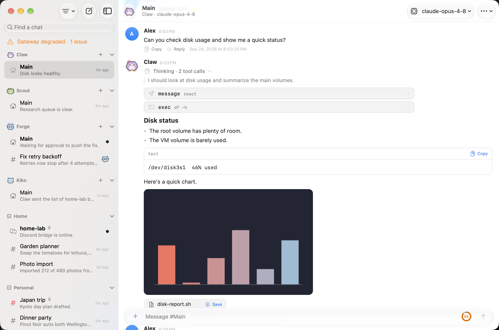

# Pincer

A native macOS and iOS client for [OpenClaw](https://github.com/openclaw/openclaw). It keeps the parts of the Discord connection that work well, organized chats and notifications, and adds what Discord can't show: thinking, tool calls, inline images, and messages attributed to you as the owner.



*Captured from the built-in demo with fictional user Alex. No live conversations or gateway credentials are shown.*


## What it is (and isn't)

Pincer is a **pure client**. It connects to a Gateway you already run and speaks the Gateway WebSocket protocol in the `operator` role. It never bundles, launches or embeds a Gateway, and it never registers as a node, so it exposes no camera, screen, shell or `system.run` capabilities. That makes it suitable for machines where the official OpenClaw app isn't allowed. Identity, secrets, transport, local storage and the sandbox are described in [Security and privacy](website/src/content/docs/reference/security.md).

## Quick start

Install Pincer (see [Install](website/src/content/docs/getting-started/install.mdx)), open it and follow the first-run setup, or choose **Try the Demo** (⌘D on macOS) to look around with a simulated gateway. No gateway needed, and nothing leaves the device. The walkthrough is in [Connect a gateway](website/src/content/docs/getting-started/connect-a-gateway.mdx) and [Setup wizard](website/src/content/docs/getting-started/setup-wizard.mdx); for remote access see [Connect over Tailscale](website/src/content/docs/getting-started/tailscale.mdx).

## Features

Everything Pincer does is documented in the website guides (source under [`website/src/content/docs`](website/src/content/docs)):

- **Chats:** [organizing chats](website/src/content/docs/guides/organizing-chats.mdx) (layouts, groups, pins, icons, colors), [sessions](website/src/content/docs/guides/sessions.mdx), the [command palette and navigation](website/src/content/docs/guides/command-palette-and-navigation.mdx), [search](website/src/content/docs/guides/search.mdx) and the [local cache](website/src/content/docs/guides/local-cache.md).
- **Conversation:** the [transcript](website/src/content/docs/guides/transcript.mdx) (thinking, tool cards, replies, reactions, images, models), [file diffs](website/src/content/docs/guides/file-diffs.mdx), [subagents and runs](website/src/content/docs/guides/subagents-and-runs.mdx), the [composer](website/src/content/docs/guides/composer.mdx) and the [offline outbox](website/src/content/docs/guides/offline-outbox.mdx).
- **Around the app:** [Quick Capture](website/src/content/docs/guides/quick-capture.mdx), the [menu bar](website/src/content/docs/guides/menu-bar.md), [Shortcuts and Siri](website/src/content/docs/guides/shortcuts-and-siri.md), [deep links and Handoff](website/src/content/docs/guides/deep-links-and-handoff.md) and the [Share extension](website/src/content/docs/guides/sharing-to-pincer.md).
- **Approvals and notifications:** [approvals, agent questions and notifications](website/src/content/docs/guides/approvals-and-notifications.mdx) and [push on iOS](website/src/content/docs/guides/push-notifications.mdx) (relay setup in [`push-relay/README.md`](push-relay/README.md)).
- **Gateway management:** [Gateway Settings](website/src/content/docs/guides/gateway-settings.mdx), [agents](website/src/content/docs/guides/agents.mdx), [devices and nodes](website/src/content/docs/guides/devices.mdx), [skills and tools](website/src/content/docs/guides/skills-and-tools.mdx), [MCP servers](website/src/content/docs/guides/mcp-servers.mdx), [health and restart](website/src/content/docs/guides/gateway-health.mdx), [channel status](website/src/content/docs/guides/channel-status.mdx), [gateway logs](website/src/content/docs/guides/gateway-logs.mdx), [command policy](website/src/content/docs/guides/command-policy.mdx), [usage and cost](website/src/content/docs/guides/usage-and-cost.mdx) and [automations](website/src/content/docs/guides/organizing-chats.mdx#automations).
- **Look and feel:** [appearance](website/src/content/docs/guides/appearance.mdx), [animated avatars](website/src/content/docs/guides/agent-avatars.mdx) and [accessibility](website/src/content/docs/guides/accessibility.md).
- **Reference:** [keyboard shortcuts](website/src/content/docs/reference/keyboard-shortcuts.md), [synced preferences](website/src/content/docs/reference/synced-preferences.md) and [troubleshooting](website/src/content/docs/reference/troubleshooting.md).

## Contributing

See [CONTRIBUTING.md](CONTRIBUTING.md) for where new checks, mock handlers, demo data and docs go.

## Building

You need a current Xcode (Swift 6, macOS 15 / iOS 18 SDKs or later), with its license accepted (`sudo xcodebuild -license accept`). The SwiftUI macros ship only inside Xcode.app, so the Command Line Tools alone won't build the UI.

```sh
swift build                      # PincerKit, PincerUI, dev app, checks
scripts/bundle-mac.sh release    # -> build/Pincer.app (ad-hoc signed)
open build/Pincer.app
```

To produce signed macOS and iOS apps, generate the Xcode project with [XcodeGen](https://github.com/yonaskolb/XcodeGen):

```sh
xcodegen generate
open Pincer.xcodeproj            # set your team, then run Pincer-macOS or Pincer-iOS
```

### Parallel dev worktrees

Builds from different git worktrees would otherwise share profiles, Keychain items, drafts, outboxes and caches. Give each worktree a development namespace; production builds have none and keep their exact identifiers.

```sh
PINCER_DEV_NAMESPACE=feature-x swift run PincerMacDev       # own Keychain service, UserDefaults suite, Drafts/Outbox folders
xcodebuild -scheme Pincer-macOS PINCER_DEV_SUFFIX=.dev-feature-x   # bundle ids, App Group and Keychain group get the suffix
```

With the suffix, `chat.pincer.mac` becomes `chat.pincer.mac.dev-feature-x`, the Keychain service `chat.pincer.gateway.dev-feature-x`, and storage folders `Pincer-feature-x`. Use the same name for both variables. On iOS the suffixed App Group and bundle ids need provisioning, so set the suffix there only when you want an isolated install. The push relay rejects the suffixed iOS topic (`chat.pincer.ios.dev-x`) unless you add it to its `APNS_TOPICS`, and it needs the aps capability provisioned. Both builds register the same `pincer://` URL scheme and Handoff type, so links and Handoff may open the other build. `PINCER_CACHE_DIR`, `PINCER_DRAFTS_DIR` and `PINCER_OUTBOX_DIR` still override folders explicitly.

### Localization

UI strings live in `Sources/PincerUI/Resources/Localizable.xcstrings`, which SwiftPM bundles with PincerUI (not the app's main bundle). Look strings up with `Text("key", bundle: .module)` or `String(localized: "key", bundle: .module)`, or the `L()` shorthand in `Localization.swift`. A bare `Text("key")` misses the catalog. After changing UI strings, run `scripts/sync-strings.sh` to regenerate the catalog. Moving strings into the catalog is ongoing. The website's Localization page explains how to add a language.

### Tests on CI

`.github/workflows/tests.yml` runs on every pull request and push to `main`: it builds every target, runs the unit tests, every `PincerChecks` mode against the demo and the mock gateway, and the mock gateway's selftest. Pull requests and pushes that only touch docs (`website/`, top-level Markdown) skip both jobs; `.github/workflows/docs.yml` builds the website instead. `.github/workflows/launch-cpu.yml` runs `scripts/check-launch-cpu.sh` nightly against a release build of `main`. See [Building](website/src/content/docs/development/building.md#continuous-integration) and [CONTRIBUTING.md](CONTRIBUTING.md).

### TestFlight

`.github/workflows/testflight.yml` archives both apps, signs them for the App Store, and uploads them to TestFlight. To run it, go to **Actions → TestFlight → Run workflow** and pick a platform (or `gh workflow run testflight.yml -f platform=both|ios|macos`), or push a `v*` tag. Only the selected platforms start a runner. Each build number is `<run number>.<attempt>`.

Signing uses manual App Store profiles through `project.appstore.yml`, which is included only when `PINCER_APP_STORE_SIGNING=YES`. `scripts/testflight.sh ios|macos` does the work and also runs locally (`UPLOAD=0` exports without uploading). The workflow needs these repository secrets:

| Secret | Contents |
| --- | --- |
| `ASC_KEY_ID`, `ASC_ISSUER_ID`, `ASC_KEY_P8` | App Store Connect API key (the `.p8` is base64) |
| `DISTRIBUTION_P12`, `MAC_INSTALLER_P12`, `P12_PASSWORD` | Apple Distribution and Mac Installer Distribution certificates (base64 `.p12`) |
| `IOS_PROFILE`, `MACOS_PROFILE` | Base64 `Pincer_iOS_AppStore_CI` / `Pincer_macOS_AppStore_CI` provisioning profiles. The iOS app ID needs the Push Notifications capability. |
| `IOS_NOTIFICATIONS_PROFILE` | Base64 `Pincer_iOS_Notifications_AppStore_CI` profile for the `chat.pincer.ios.notifications` notification service extension |
| `IOS_SHARE_PROFILE`, `MACOS_SHARE_PROFILE` | Base64 `Pincer_iOS_Share_AppStore_CI` / `Pincer_macOS_Share_AppStore_CI` profiles for the Share extensions (`chat.pincer.ios.share`, `chat.pincer.mac.share`) |

The iOS app and Share extension profiles need the App Groups capability with `group.chat.pincer`. macOS uses the team-prefixed group `E4Y97NXBXG.chat.pincer`, which needs no portal setup. The shared Keychain group `E4Y97NXBXG.chat.pincer.shared` is already covered by the default `E4Y97NXBXG.*` keychain entitlement. The certificates and profiles expire on 2027-09-25. Renew them before then and update the secrets.

### Layout

| Path | Contents |
| --- | --- |
| `Sources/PincerKit` | Protocol client (handshake, signing, reconnect, TLS pinning), models, and the observable stores. No UI. |
| `Sources/PincerUI` | Shared UI for macOS and iOS. The app shell is SwiftUI. The chat transcript and sidebar are native for performance: `NSTableView`/`NSOutlineView` on macOS and `UICollectionView` on iOS. Markdown is laid out once with TextKit (`TranscriptSupport`, `TranscriptRowView`), and the same part views are shared by both platforms. |
| `Apps/macOS`, `Apps/iOS` | `@main` app shells used by the Xcode project. |
| `Apps/Shared` | Resources shared by both apps, including the app icon (`AppIcon.icon`) and the Info.plist keys that name the App Group and Keychain group. |
| `Apps/Intents` | App Intents (Shortcuts, Siri, Action Button) compiled into both apps; the logic (`IntentService`) lives in PincerKit. |
| `Apps/ShareExtension` | Share extensions for iOS and macOS: a view controller per platform plus the shared SwiftUI sheet. The logic (`ShareModel`, `SharedContent`) lives in PincerKit. |
| `Design/AppIcon` | Flattened reference artwork for the app icon (`Pincer.svg`). The shipped icon is `Apps/Shared/AppIcon.icon`, a layered Icon Composer file (gradient background + glass speech-bubble layer) with Default, Dark, Clear and Tinted appearances; edit it in Icon Composer (Xcode ▸ Open Developer Tool). Xcode renders flat fallbacks for iOS 18 / macOS 15. |
| `Sources/PincerMacDev` | Dev entry point so SwiftPM alone can produce the macOS app. |
| `Sources/PincerChecks` | Self-checks: per-domain `*Checks.swift` files, and `Registry.swift` listing which run in each mode. |
| `Tests/PincerKitTests` | Swift Testing unit tests for PincerKit's pure logic (framing, signing, URL/TLS policy, caches, sidebar, slash commands, approvals). |
| `Sources/PincerPush` | Web Push decryption (RFC 8291), per-gateway push keys and payload parsing, shared by the app and its notification service extension. |
| `Apps/iOSNotificationService` | iOS notification service extension that decrypts relayed pushes. |
| `push-relay/` | Zero-dependency Node relay from Gateway Web Push to APNs. |
| `mock-gateway/` | Node mock of the Gateway protocol for offline development. |

## Testing without a real gateway

The app has a built-in demo (**Try the Demo** on the first screen, ⌘D on macOS): a simulated Gateway on the device with sample agents, chats and data. It's what TestFlight and App Review testers use. See [Try the demo](website/src/content/docs/getting-started/try-the-demo.mdx).

For the full protocol, including Gateway Settings, run the Node mock (message triggers, environment variables and seeded data are in [Mock gateway](website/src/content/docs/development/mock-gateway.md) and [`mock-gateway/README.md`](mock-gateway/README.md)):

```sh
cd mock-gateway && npm install
npm start                                   # ws://127.0.0.1:18789, token "dev-token"
MOCK_TOKEN= MOCK_BACKGROUND=1 npm start     # no auth, simulated Discord traffic
```

Run the unit tests with `swift test --parallel`. Run the self-checks with `swift run PincerChecks` (offline), `--demo` (the built-in demo) or `--live-core` / `--live-extras <url> <token>` against a fresh mock; `scripts/run-checks.sh` runs everything side by side. The modes and their environment variables are in [Building](website/src/content/docs/development/building.md#self-checks). To see what the gateway says about each request, use `PINCER_REQUEST_LOG` (see [Troubleshooting](website/src/content/docs/reference/troubleshooting.md)). How to add checks, mock handlers and demo data is in [CONTRIBUTING.md](CONTRIBUTING.md).

## Known gaps

- iOS runs in the simulator (connect, sidebar, history), but hasn't been tried on a real device yet.
- The Share extension is tested against the demo and the mock over a real socket; it hasn't been tried from the share sheet on a real device yet.
- Handoff between Mac and iPhone needs two real devices on the same Apple Account, so it's covered by unit tests only.
- Automations has been tested against the mock only.
- Health and restart have been tested against the demo and the mock only, not a real gateway restart.
- Gateway Settings has been tested against the mock only. It doesn't browse the ClawHub catalog, show install progress, or edit lists of objects in forms (use the raw editor).
- Channel Status has been tested against the demo and the mock only. Adding channel accounts isn't on that page; use Gateway Settings → Channels.
- Pairing Requests has been tested against the demo and the mock only. There's no approved-sender list or removal, and no push for new requests.
- First-run **Nearby** discovery hasn't been tried against a real gateway yet. Bonjour is on by default for gateways on macOS; on other hosts run `openclaw plugins enable bonjour`, and the gateway has to accept connections beyond loopback to be reachable.
- Devices and Nodes have been tested against the demo and the mock only. Nodes can be renamed but not removed.

## License

MIT. See [LICENSE](LICENSE).
