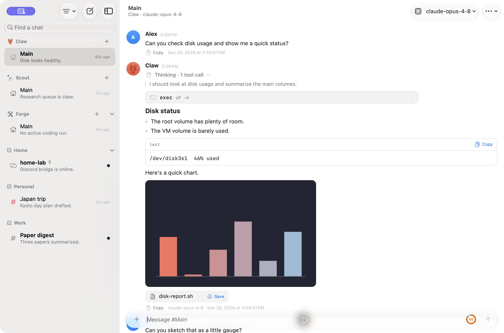
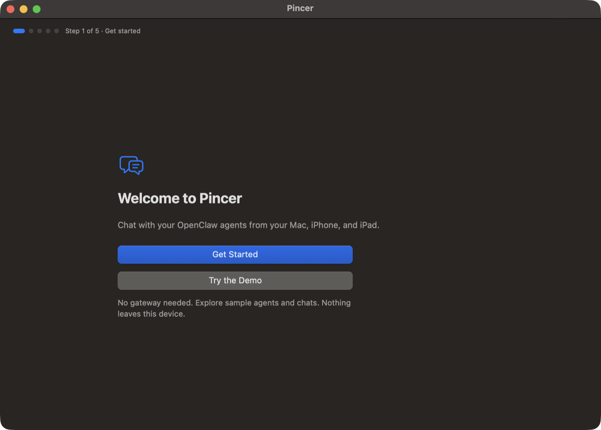

# Pincer

A native macOS and iOS client for [OpenClaw](https://github.com/openclaw/openclaw). It keeps the parts of the Discord connection that work well, organized chats and notifications, and adds what Discord can't show: thinking, tool calls, inline images, and messages attributed to you as the owner.



*Captured from the built-in demo with fictional user Alex. No live conversations or gateway credentials are shown.*


## What it is (and isn't)

Pincer is a **pure client**. It connects to a Gateway you already run and speaks the Gateway WebSocket protocol (v4) in the `operator` role, with the `operator.read`, `operator.write`, `operator.approvals` and `operator.questions` scopes. Devices paired before Pincer asked for `operator.questions` raise a one-time scope-upgrade request on their next connect. Pincer keeps working without the scope in the meantime: when the agent asks something, the chat shows the `openclaw devices approve <requestId>` command to run on the Gateway host (or approve it from **Gateway Settings → Devices** on another device with Full Management), and **Try Again** picks up the scope once it's approved. If you set a gateway's **Access** to **Full Management** (Gateway Settings → Connection), it also asks for `operator.admin`, which the gateway has to approve once more.

It **never** bundles, launches or embeds a Gateway, and it never registers as a node, so it exposes no camera, screen, shell or `system.run` capabilities. That makes it suitable for machines where the official OpenClaw app isn't allowed.

- **Identity:** each install creates an Ed25519 device key, stored in the Keychain and marked this-device-only. The gateway must approve the device once.
- **Secrets:** gateway tokens and passwords are stored in the Keychain and never in UserDefaults. In the Xcode-built apps, the device key, secrets and device tokens sit in a Keychain group (`chat.pincer.shared`) that only Pincer and its extensions (Share and, on iOS, the notification service extension) can read, and the list of saved gateways (no secrets) sits in the App Group. The first launch after updating moves existing items there.
- **Transport:**
  - `wss://` is required for anything other than loopback, private LAN or Tailscale addresses.
  - You can pin a TLS certificate by its SHA-256 fingerprint.
  - Images are fetched only from the gateway itself: inline, through `artifacts.download`, or from the gateway's own host.
- **Local cache:** transcripts are cached in `~/Library/Caches/Pincer/Transcripts/<gateway>/`, one file per chat, up to 20,000 messages each. Files use complete file protection, and removing a gateway deletes its cache. Each file records its format version: older files are migrated when possible, and files Pincer can't upgrade or that come from a newer Pincer are deleted and reloaded from the gateway. Damaged (empty, truncated or unreadable) files are moved to `Quarantine/` in the gateway's folder (the 5 newest are kept, logged under `chat.pincer`/`TranscriptCache`) and the chat reloads from the gateway, with no error shown. **Settings → Storage → Clear Cache…** shows the cache size and deletes every gateway's transcripts, search indexes and quarantined files. The message search index (`search-index.sqlite`) lives in the same folder and is deleted with it. Set `PINCER_CACHE_DIR=off` to turn the cache (and message search, except in the demo, which then keeps its index in memory) off, or set it to a path to use another folder.
- **Drafts:** each chat keeps its unsent text and pending attachments when you switch chats or relaunch. They're saved in `~/Library/Application Support/Pincer/Drafts/<gateway>/`, one folder per chat, using complete file protection. A draft is deleted when you send it, when its chat is deleted, or when you remove its gateway. Set `PINCER_DRAFTS_DIR=off` to turn draft saving off, or set it to a path to use another folder.
- **Sandbox:** the Xcode-built macOS app is sandboxed, with outgoing network access and read-only access to files you pick. The quick `scripts/bundle-mac.sh` dev bundle is only ad-hoc signed.

## Quick start

The first time you open Pincer, a short setup walks you from launch to your first chat. Every step has **Back**, a progress bar shows where you are, and Pincer resumes where you left off if you quit.

1. **Welcome:** choose **Get Started**, or **Try the Demo** right under it (⌘D on macOS) to look around with a simulated gateway: "No gateway needed. Explore sample agents and chats. Nothing leaves this device." One tap lands in the chat list, with no setup. This is the path for App Review and TestFlight testers.

   
2. **Do you have a gateway?** If not, Pincer shows how to set one up. On the computer that will host it:
   ```sh
   curl -fsSL https://openclaw.ai/install.sh | bash   # install and onboard; choose Quick start
   openclaw gateway install                            # keep it running in the background
   openclaw gateway status                             # should be listening on port 18789
   ```
   See OpenClaw's [Getting started](https://docs.openclaw.ai/start/getting-started) (Windows: `iwr -useb https://openclaw.ai/install.ps1 | iex`).
3. **Find your gateway:** choose **This Mac** (`ws://127.0.0.1:18789`), **Tailscale** (`wss://my-mac.tail1234.ts.net`) or **Same Wi-Fi** (`ws://192.168.1.20:18789`). Gateways that announce themselves on your network show up under **Nearby**. Pincer checks that it can reach the gateway before moving on.
4. **Sign in** with the gateway's token. To see it, run `openclaw config get gateway.auth.token` on the gateway host (or `openclaw config get gateway.auth.password` if it uses a password).
5. **Approve this device:** Pincer shows the command to run on the gateway host, `openclaw devices approve <requestId>`, and continues by itself once you approve it. Your first device always needs the host; after that, a device with **Full Management** can approve others from **Gateway Settings → Devices**.
6. **You're connected:** Pincer shows the gateway's name, version and access. Then **Continue Setup** to pick your default agent and model, look at skills and send a test message, or **Skip to Chats**.

**Add Gateway…** (in the sidebar's **Organize** menu, **File ▸ Add Gateway…** on macOS, the menu bar or ⌘K) starts the same flow at step 3. TLS pinning, access level and "no auth" live behind **Advanced…** on the **Find your Gateway** step and in Gateway Settings → Connection. The full walkthrough, with every error message and what to do about it, is on the website: [Connect a gateway](website/src/content/docs/getting-started/connect-a-gateway.mdx).

## Features

- **Layout:**
  - by default, a **"By server"** layout: each Discord server gets a section with its `#channels`, automations get their own section when shown, and everything else is grouped under its agent. You can also group by agent, by group, or by recency;
  - server names come from the gateway's Discord config (`channels.discord.guilds.<id>.slug`) when it's set; otherwise the section is just called "Discord". Discord categories aren't sent at all. To name a server yourself, right-click its header and choose **Rename Server…**. Names you set sync to your other devices through the gateway's user preferences (`users.prefs`, key `pincer.serverNames`); if the gateway has no durable identity for your connection, they stay on this device. To recreate categories, choose **New Group…** from the Organize menu (or a group header's menu), or right-click a channel and choose **Move to Group → New Group…**. Groups sync through the gateway;
  - subagent (helper) runs stay out of the sidebar, like Discord: open one from the **Open run** button on the tool call that started it or from the chat's **Runs** panel, and a spinner on the parent shows helpers are working. Settings → Sidebar can list them under their parent (behind a ✨ count chip) instead. They never add to unread counts or notifications;
  - automation (cron) and slash-command chats are hidden by default. **Show Automations** and **Show Slash Commands** in the Organize menu (next to **Show Archived**) list them in every layout; the choice is saved per gateway. While hidden they don't add to unread counts or section badges, but the open chat stays listed, typing in "Find a chat" matches them, and Search Messages, ⌘K, links and **Organize → Automations…** still open them;
  - custom chat icons: right-click a chat and choose **Change Icon…** to pick an SF Symbol (tinted with the chat's color), or **Reset Icon** to go back to the default. Icons sync to your other devices through `users.prefs` (key `pincer.chatIcons`), since the gateway's session `icon` only takes emoji, named glyphs or SVG. Named glyphs set by other OpenClaw clients are shown too;
  - pinned chats. New chats you start are listed on their own, like in the Control UI; only forks and branches nest under their parent;
  - compaction doesn't start a new chat. It shows up inline as a "Compacting context…" line while it runs, then as a divider in the same thread;
  - search, unread dots and dock badge;
  - "Next Unread Chat" (⌥⇧↓).
- **First-run setup** (shown whenever there are no gateways, and from **Add Gateway…**): Welcome → "Do you have a gateway?" (with the real OpenClaw install commands) → Find your gateway (This Mac, Tailscale or Same Wi-Fi, with Bonjour `_openclaw-gw._tcp` results under **Nearby**, and a reachability check) → Sign in (token or password, with the `openclaw config get gateway.auth.token` command) → Approve this device (`openclaw devices approve <requestId>`, continues by itself) → You're connected (name, version, access, and any health note) → gateway setup. Resumes after a relaunch; the gateway is only saved once it connects. See the [connect guide](website/src/content/docs/getting-started/connect-a-gateway.mdx).
- **Gateway setup** (right after first-run setup; any time from the gateway's menu, ⌘K → "Set Up Gateway…" or Gateway Settings → Overview): **Agent & Model**, **Skills** (optional) and **Test Message** steps, each skippable, with progress remembered per gateway. There's no channels step: Pincer is the direct way to talk to your agents. Agent & Model saves the default agent (`agents.entries.<id>.default`) and model (`agents.defaults.model.primary`) with `config.patch`, which needs **Full Management**. Skills lists what `skills.status` says isn't set up yet, for information only; it never counts as a problem. Test Message sends "Hi! Are you there?" (or your own text) straight to the default agent in a *Setup Test* chat, created the first time, and shows the reply in setup ("Your agent replied."); **Finish** lands in the chat list with that chat selected. Afterwards, a one-time **Tips** card covers slash commands, `/think`, approvals, ⌘K, Find and Search; **Settings → General → Show Tips Again** brings it back. **Try the Demo** lands straight in the chat list; in the demo, setup opens from the gateway menu or ⌘K, never saves progress and runs with standard access. See the [setup guide](website/src/content/docs/getting-started/setup-wizard.mdx).
- **Command palette and quick switching** (**Go** menu):
  - ⌘K opens a palette to jump to any chat on any gateway (recently visited first), start a new chat with an agent, change the chat's model, pin or unpin it, show or hide thinking steps, switch gateways, or open Settings, Gateway Settings, Automations, Approval History, Command Policy or Gateway Logs. Type to filter (fuzzy, so `jptr` finds "Japan trip"), use ↑/↓ to move, Return to run and Esc to go back or close;
  - **Search Messages** (⇧⌘F, "Search Messages for …" in ⌘K, or the "Search messages for …" row that appears above the sidebar's chat list while you type in "Find a chat") searches the text of every cached chat on the selected gateway, including older history you haven't scrolled to. Results are grouped by chat (newest first, up to 3 per chat) with the sender, date and a highlighted snippet; picking one opens the chat with Find in Chat on that message. Matching ignores case and accents, each word must match from its start (`tok` finds "Tokyo", `kyo` doesn't), and multi-word queries must appear as a phrase. Only user and assistant message text is searched, not thinking or tool output. The index lives on disk next to the transcript cache and is built in the background;
  - Back (⌘[) and Forward (⌘]) move through the chats you've visited, like a browser;
  - ⌘1–⌘9 open the selected gateway's pinned chats, in sidebar order.
- **Deep links and Handoff** ([guide](website/src/content/docs/guides/deep-links-and-handoff.md)):
  - `pincer://open?gateway=<UUID|demo>[&url=<gatewayURL>]&session=<sessionKey>[&message=<id>]` opens a chat, and scrolls to a message if one is given. Values are percent-encoded. `url` (credentials stripped, never a token) lets another device find the gateway when its UUID differs. Links therefore contain your gateway's address, so don't share them publicly if the host is private. The gateway and session match the Shortcuts chat identifier `<gatewayUUID>/<sessionKey>`;
  - **Copy Link to Chat** in the chat's ⋯ menu copies the link. Demo chats have links too (`gateway=demo`), and opening one adds the demo gateway if it's missing;
  - an unknown gateway, chat or message opens Pincer with a short notice instead of failing silently;
  - Handoff offers the open chat to your other Mac or iPhone while it's visible, and stops when the gateway disconnects. It needs the same Apple Account and an app signed with the same Team ID on both devices;
  - links, notifications, the menu bar, message search, **Open Chat** and Handoff share one router. A link or Handoff only navigates: it never sends, fills in the composer or answers an approval.
- **Quick Capture** (macOS): press ⌃⇧Space from any app to open a small floating composer, even when the main window is closed. It remembers the chat you last sent to.
  - To pick a recent chat or **New Chat with** an agent, click the target or press ⌘J (or Tab). Type to filter, ↑/↓ to move, and ⌘1–⌘9 for pinned chats.
  - Return sends (`chat.send`, after `sessions.create` for a new chat) without leaving what you're doing. ⌘Return sends and opens the chat in Pincer, ⌘O opens it without sending, and Esc closes and keeps your text.
  - Paste or drag in images and files, as in the main composer.
  - Change or turn off the shortcut in Settings → General → Quick Capture. It uses a standard system hotkey, so no Accessibility permission is needed. It's also in the **Go** menu.
  - Turn on **Open at Login** in Settings → General → Launch so Pincer, and the shortcut, is ready after you log in. It's off by default. If macOS asks you to approve it, use **Open Login Items Settings…**.
- **Menu bar** (macOS, optional): Quick Capture, unread chats, active runs, pending approvals and each gateway's status from the menu bar. Turn it on in Settings → General → Menu Bar.
- **Transcript:**
  - live streaming, with a collapsible **thinking** section and **tool cards** showing arguments and results. Choose whether to show thinking steps never, only live, or for every turn;
  - **file diffs** in tool cards: `write`, `edit` and `apply_patch` calls (and aliases like `edit_file`, `multi_edit`, `str_replace_editor`) show a colour-coded, monospaced diff instead of raw JSON arguments, with the file name and green/red added and removed counts. A patch shows each file it touches, and a new-file write shows every line as added. The gateway's own result diff is preferred when it sends one. Diffs over 20 lines show their first 12 until you choose **Show all**. Very large changes are capped (600 lines a side, 120,000 characters, 400 lines shown), and counts that are only a minimum end in `+`. **Copy** copies a unified diff, or a written file's contents. Find in Chat searches the diff lines. Failed calls and arguments Pincer can't read show the raw arguments. Chats cached before this version diff from the arguments until the cache is cleared. See [`website/src/content/docs/guides/file-diffs.md`](website/src/content/docs/guides/file-diffs.md);
  - the full history of every chat loads in the background, so scrolling up never waits for the network. After connecting, Pincer quietly caches every chat (most recently active first) and skips chats that haven't changed. Opening one shows the cached transcript at once, then fetches only what's new;
  - Markdown, including tables and code blocks with a Copy button;
  - **Find in Chat** (⌘F, or the Session menu): highlights every match with a count, and ⌘G / ⇧⌘G (or Return) step through them, scrolling to each one. Matches in thinking and tool input/output are optional (the find bar's options menu) and are expanded when you land on them;
  - **Replies**: **Reply** in a message's footer or context menu, or ⇧⌘R for the last message, shows a "Replying to" chip above the composer (✕ or Esc cancels) and sends with `chat.send`'s `replyToId`. Replies show the original in a quote card; click it to jump there, loading older history if needed. Gateways that don't accept `replyToId` get the original quoted in the text instead;
  - **Reactions**: emoji chips under messages, with counts and who reacted. React from the footer, the context menu (with six quick reactions) or a chip. Your reactions sync through `users.prefs` (key `pincer.reactions`); reactions the agent made with its `message` tool show from history, and a faint 👀 marks the message the agent is working on. In bridged chats, reactions on your own messages are also sent to the channel with `message.action` when the gateway offers it; everything else is kept in Pincer. Not yet: a dedicated `reactionLevel` control, swipe to reply, and sending your reactions to the agent as feedback;
  - every message ends with **Copy**, **Reply** and **React** buttons and its details: the model that wrote it and the full date and time it was sent. Back-to-back messages from the agent each get their own footer and some space, and replies from a different run start a new row;
  - **inline images** with a Quick Look-style preview and sharing. This covers attachments and the agent's `MEDIA:` lines, the same as the web UI. Local files are fetched through the gateway's `assistant-media` route. Public `https` images are downloaded directly, with no credentials or cookies sent; you can turn this off in Settings with "Load images the agent links from the web".
- **Subagent tree and run timeline** ([guide](website/src/content/docs/guides/subagents-and-runs.md)): **Runs** in the chat toolbar (or ⌥⌘R, or **Show Runs** in the chat's ⋯ menu) opens an inspector on macOS and regular-width iPad and a sheet in compact width:
  - **Tree**: every helper run the chat spawned, nested by `spawnedBy` / `parentSessionKey` however deep it goes. Each row shows its status (Running, Done, Failed, Stopped, or Unknown while disconnected), the agent, the duration and its last activity. Double-click a row or press Return on macOS, or tap it on iOS, to open that helper's chat, even when helpers are hidden from the sidebar. Its context menu has **Open**, **Show Timeline** and **Copy Session Key**. The toolbar button is tinted and pulses while a helper is working;
  - **Timeline**: one lane per run on a shared time axis, built from the streamed `agent`/`chat` events: thinking, tool calls (red when they failed), replies, and markers for errors and aborts, with each run's total duration. Hover or tap a segment for details, and double-click or tap a lane header to open that run's chat;
  - the demo gateway's research chat has spawned helpers that are finished (one with a nested helper), still running, failed, and stopped.
- **Appearance:** Settings → Appearance picks Light, Dark or System and a theme: Default (your system accent), Lobster, Ocean, Forest, Grape, Sunset, Graphite or Midnight. Themes color the accent, links, both avatars, and the chat, sidebar and code backgrounds, with separate shades for light and dark mode. Any of those colors can be overridden with your own pick, and reset back to the theme's.
- **Animated avatars:** each agent gets a small companion pet (a blob, owl, rock or sprout, drawn in pixel art or as a soft plush) that reacts to what the agent is doing: it blinks when idle, wiggles while thinking, sways while replying, shows a tool badge while a tool runs, raises a paw for approvals, hops when a run finishes, wobbles on errors and dozes while compacting. The look is picked from the agent's identity, so each agent is different. Settings → Appearance turns them off, switches Pixel and Plush, and lets you pick a character per agent. Reduce Motion gives still poses. The website's Agent avatars guide has the details.
- **Accessibility:** VoiceOver reads each message as one item, with Copy, Reply and Add Reaction in the actions rotor, and announces when the agent finishes replying in the open chat. Sidebar rows, the composer's controls and Settings have spoken labels. The transcript, sidebar and composer follow Dynamic Type on iOS, and the keyboard reaches the sidebar, command palette, composer and find bar. The website's Accessibility guide has the details.
- **Owner attribution:** messages from you appear under your own name (set in Settings, default is your macOS full name), even when they came in through Discord. A small "via Discord" tag shows where they came from.
- **Messages from other agents:** when another agent messages a chat (`sessions_send`), it shows under that agent's avatar and name with a "from Kiko’s chat" marker that opens the source chat; automation (cron) and helper messages are attributed to the automation or helper. Search results and reply quotes name the real sender.
- **Models:** the chat toolbar shows the session's model; pick another (from the Gateway's `models.list`) or go back to the agent's default, and new messages use it. Each reply's footer shows the model the Gateway recorded for it, so earlier replies keep their original model after a switch.
- **Offline sending & retry:** you can keep writing while disconnected. Text messages and replies are queued in a per-gateway outbox, shown inline as **Queued**, **Sending…** or **Failed — Retry**, and sent in order when that gateway reconnects. Each message keeps one `chat.send` idempotency key across retries and relaunches, so it's delivered once. A failed message blocks later ones in its chat until you **Retry** or **Delete** it (buttons, context menu or VoiceOver actions). Drops go back to the queue; timeouts, rejections (with the gateway's message) and lost access show **Failed**. Attachments, slash commands and Quick Capture need a connection, and a failed attachment send lasts until you quit. The outbox survives relaunches, lives in `Application Support/Pincer/Outbox/<gateway>.json`, not Caches (so **Clear Cache…** doesn't touch it; `PINCER_OUTBOX_DIR=off` keeps it in memory), and **Settings → Storage → Clear Outbox…** empties it. See [`website/src/content/docs/guides/offline-outbox.md`](website/src/content/docs/guides/offline-outbox.md).
- **Composer:** Return sends and ⇧/⌥-Return adds a new line. You can paste, drag in or pick images and files; they are downscaled to fit the gateway's limits. Stop a run with ⌘.
- **Context meter:** a ring next to Send shows how full the chat's context window is, from the session's token snapshot (the row's context limit or prompt budget, else the model's window from `models.list`, else the Gateway default). It turns orange at 85% and red at 95%. Click it for used/limit, the last run's tokens and **Compact Now**, with optional instructions for what to keep; the result reads "Compacted 172k → 31k tokens." With Full Management it calls `sessions.compact`; otherwise, or with instructions, it sends `/compact`.
- **Slash commands:** typing `/` suggests the commands the gateway offers for that chat (`commands.list`: built-ins, skills and plugins), then their arguments: listed choices (`/verbose on`), the agent's models for `/model`, and the session's thinking levels for `/think`. Use ↑/↓ to move, Tab or Return to complete, Esc to hide; Return sends once the command is complete. `/clear` is sent as `/reset`, like the Control UI. Gateways without `commands.list` get a built-in list of common commands.
- **Approvals:** exec approvals appear as a banner and as actionable notifications with **Allow once**, **Always allow** and **Deny**. The actions work from the lock screen and without opening Pincer: it connects in the background (even if it wasn't running), sends `exec.approval.resolve` to the gateway the approval came from, and removes the notification once the gateway confirms. On iOS, both Allow actions require unlocking the device (Face ID, Touch ID or passcode); Deny doesn't, since it can only stop a command. **Always allow** is offered only when the approval's `allowedDecisions` permit it (Gateways that don't send the field get all three). An approval answered elsewhere disappears on its own. If an action comes too late, a follow-up notification says so instead: "That approval expired. Nothing was run.", "Already answered elsewhere.", or, if the gateway can't be reached within about 25 seconds, "Couldn't reach … — the command is still waiting." with the actions to try again. The decision is never saved and sent later. Follow-ups never show the command.
- **Approval History** (Gateway Settings, or ⌘K → "Approval History…") lists the last 30 days of decisions on commands, plugins and system changes, newest first: what was asked, by which agent and chat, how it ended and who decided (`approval.history`, `approval.get`). Filter by kind, **Load More** for older entries, and select one for its full details. Gateways without approval history say so.
- **Gateway Logs** (Gateway Settings, **Organize → Gateway Logs…**, or ⌘K → "Gateway Logs…") shows a live tail of the gateway's own log file, like `openclaw logs --follow`. While the page is open, Pincer polls `logs.tail` every 2 seconds from a byte cursor (500 lines / 250 KB per poll), so only new lines arrive; it needs just `operator.read`. Each line shows its time, level, subsystem and message. Level toggles (trace and debug are off by default; lines without a level always show) and search (case- and accent-insensitive, over the message, subsystem and raw line) filter instantly with a match count. The list follows new lines; scroll up to read and **Jump to Latest (N new)** takes you back. **Pause** stops polling and **Resume** catches up from where it stopped. Log rotation, truncation and skipped output show as markers instead of clearing the list. Copy lines (⌘C or the context menu, macOS multi-select with ⌘/⇧-click; long-press on iOS), **Show Raw** for the JSON, and **Export…** saves the visible raw lines as a `.log` file after a reminder that they can still contain hostnames, paths and message content. Lines are redacted by the gateway and kept in memory only (the last 2,000 lines or 8 MB). Gateways without `logs.tail` say so. This is the gateway's log; `PINCER_REQUEST_LOG` (below) is Pincer's own request log.
- **Usage & Cost** (Gateway Settings → Usage, ⌘K → "Usage & Cost…") shows what the Gateway has spent on tokens: summary tiles, a daily chart split into input, output and cache tokens, a breakdown by model, provider or agent, the top sessions, and provider rate limits with reset times (`usage.status`, `usage.cost`, `sessions.usage`). Pick Today, 7 Days (the default), 30 Days, 90 Days or a custom range. Double-click (macOS) or tap (iOS) a session, or choose **Session Usage…** from a chat's ⋯ menu or ⌘K, for its totals, usage over time and message log (`sessions.usage.timeseries`, `sessions.usage.logs`). Costs are the Gateway's USD estimates and can be partial or unknown when a model has no pricing. Each part says so when the Gateway doesn't support it or refuses it for your operator role.
- **Agent questions:** when the agent asks you something (`ask_user`), a question card appears above the composer, like the Control UI's. Pick an option (click it or press its number), type your own answer, and **Submit**, or **Skip** to tell the agent you'd rather not answer. Prompts with several questions step through them with **Next**/**Back** and send every answer together (`question.resolve`). Questions answered elsewhere, for example with Discord's buttons, disappear on their own, and a question in a chat you aren't looking at posts a notification.
- **Notifications:** one notification thread per chat, tap to open the chat, and no notification for the chat you're already looking at.
- **Push on iOS:** with a [push relay](push-relay/README.md) set in Settings → Notifications, finished replies and exec approvals still arrive when Pincer is suspended or closed. Pincer subscribes to the Gateway's Web Push (`push.web.subscribe`). The relay forwards the encrypted payload to APNs, and a notification service extension decrypts it on the device. Neither the relay nor Apple can read it. The Gateway sends only a generic title and the chat or approval it refers to, so opening the notification loads the content. Approval pushes are actionable: Allow once, Always allow and Deny work from the lock screen, as for local notifications. Setup takes about 10 minutes on the Gateway machine; see [`push-relay/README.md`](push-relay/README.md).
- **Gateway settings** (**Pincer → Gateway Settings…**, ⇧⌘, on macOS, or the gateway's menu in the sidebar): a window on macOS and a sheet on iOS, with a sidebar of pages:
  - **Connection** (this device's URL, token, access level and TLS pin; **Apply** reconnects), **Overview** (version, config file and health), **Health** (see below), **Channel Status** (see below), **Approval History** (past approval decisions; also under **Organize → Approval History…**), **Gateway Logs** (a live tail of the gateway's log; see above) **Pairing Requests** (see below), and **Devices** and **Nodes** (see below);
  - **Command Policy** (also ⌘K → "Command Policy…"): which commands agents may run on the Gateway host and when they ask, as defaults and per-agent overrides, plus each agent's allowlist of commands and tools added with **Always allow**, which you can review and remove. It reads and writes the Gateway's exec approvals file (`exec.approvals.get`, `exec.approvals.set`), which needs **Full Management**; Save asks first when a change loosens the policy;
  - **Agents** (Gateway Settings → Agents & Models): create, edit, duplicate and delete agents (name, emoji, avatar, model, workspace; `agents.create`, `agents.update`, `agents.delete`), and edit each agent's workspace bootstrap files such as `AGENTS.md` and `SOUL.md` in a monospaced editor with Markdown preview (`agents.files.list`, `agents.files.get`, `agents.files.set`). Saves carry the file's hash, so if it changed on the gateway meanwhile Pincer keeps your edits and offers to compare, reload or overwrite. Files are capped at 2 MB, unsaved edits are guarded on close, and deleting keeps the agent's workspace and sessions unless you choose **Delete and Move Files to Trash**. Reading needs `operator.read`; changes need **Full Management**. The sidebar updates straight away;
  - **Skills** (also ⌘K → "Skills…"; [guide](website/src/content/docs/guides/skills-and-tools.md)): each agent's skills grouped as Ready, Needs Setup, Blocked or Disabled, with the reason and a requirements checklist (`skills.status`); search ClawHub and install, update or reinstall skills after a confirmation, with ClawHub's trust warnings shown (`skills.search`, `skills.detail`, `skills.install`, `skills.update`); turn skills on or off and set their API key or environment values (write-only; values are never shown). Browsing needs `operator.read`; changes need **Full Management**. The page, ClawHub search and each action are hidden when the gateway doesn't offer them;
  - **Sessions** (also ⌘K → "Manage Sessions…", or a chat's ⋯ menu → **Manage Session…**; [guide](website/src/content/docs/guides/sessions.md)): every session on the gateway, filtered **Active** (default), **Archived** or **All** and searchable, with its latest run's status and duration (`sessions.list`), a quick preview of its last messages (`sessions.preview`) and a details page (`sessions.describe`). Select several to archive, unarchive or delete them (`sessions.patchMany`, else `sessions.patch` one at a time; `sessions.delete` after a confirmation). A session's branches can be listed and switched (`sessions.branches.list`, `sessions.branches.switch`), it can be rewound to one of your recent messages, which goes back into the composer (`sessions.rewind`), and a session interrupted by a gateway restart can be recovered (`sessions.recover`, OpenClaw 2026.8+). Deleting, switching and rewinding drop the session's cached transcript and reload the open chat. Browsing needs `operator.read`; archiving, recovering and deleting archived sessions need `operator.write`; deleting other sessions, switching branches and rewinding need **Full Management**. The page is hidden when the gateway doesn't offer `sessions.list`, and so are controls it doesn't offer;
  - **Effective tools** (a chat's ⋯ menu → **Tools & Policy…**, before or during a run, or an agent's **Tools** in Agents & Models, which uses the agent's main or latest chat, or its profile defaults if it has none): every tool the chat or agent could call, grouped, with its source (core, plugin, channel, MCP) and whether policy allows it and why (`tools.effective`, `tools.catalog`). Read-only; hidden on gateways without those methods;
  - curated pages (Gateway, Agents & Models, Channels, Sessions & Messages, Tools & Skills, Automation) built from the gateway's own schema (`config.get` / `config.schema`), with rarely used fields under **Advanced**. Sections the gateway's schema doesn't have are hidden;
  - **Plugins**: list, add (ClawHub, npm or git), remove, enable and disable plugins, and fill in their settings and credentials (`plugins.*`);
  - **All Settings** (every field, grouped by section) and **Raw Config** (JSON5, `config.apply`) for anything else. Search in the sidebar finds any setting and jumps to it;
  - edits from every page go into one draft. The toolbar shows how many are unsaved, and the **Unsaved** count opens a review of each change. **Save** (⌘S) sends the draft with `config.patch`, so the gateway validates, persists and hot-applies them. Invalid values come back with the field and reason, and changes that need a gateway restart say so. If the config changed on the gateway meanwhile, Pincer rebases the draft and asks about any conflicting setting;
  - secrets are shown only as "saved" and are never sent back to the gateway unless you change them;
  - editing needs **Access → Full Management** on the Connection page (and the gateway's approval); otherwise settings are read-only.
  - **Pairing Requests**: people who messaged one of your channel accounts that uses `dmPolicy: "pairing"` and are waiting to be let in (`channels.pairing.list`). Each request shows the sender's name or username if they set one, the channel's sender id (the part you can trust, always shown), the channel and account, and when it was asked and expires. **Approve** asks first, and can tell the sender they were approved when the channel supports it (`channels.pairing.approve`); on a gateway without a command owner, Full Management can also make them the command owner. **Dismiss** removes a request without blocking the sender, who can ask again (`channels.pairing.dismiss`). The sidebar badge counts pending requests. Reviewing requests needs **Access → Full Management**: the pairing methods need `operator.pairing`, which Pincer doesn't ask for because it would also let this device approve new devices and nodes, and `operator.admin` covers it. There's no event for new requests, so the list refreshes when the page opens and every 30 seconds while it's showing, not with a notification. The pairing code the sender got isn't part of the protocol, so Pincer doesn't show one. Already approved senders aren't listed and can't be removed here; edit the channel's allowlist on the gateway. Gateways without channel pairing say so.
  - **Devices**: the devices waiting to pair with the gateway (**Pending Requests**) and the ones already paired (`device.pair.list`), each with its name, platform and client, a short fingerprint of its device id (full id on hover or with **Copy Device ID**), role and scopes, and whether it's connected or when it was last seen. The device Pincer uses is tagged **This Mac**/**This iPhone**/**This iPad**, requests for more access from a paired device are tagged **Scope upgrade**, and requests for the `node` role say that agents could run commands there. **Approve** and **Reject** resolve a request (`device.pair.approve`, `device.pair.reject`); each paired device's menu has **Rename…** (`device.pair.rename`, where supported) and **Revoke…**, which asks first and removes the device, which has to pair again (`device.pair.remove`). Revoking this device warns that Pincer will be disconnected until it's approved again. The sidebar badge counts pending requests, and the list updates from the `device.pair.requested`, `device.pair.resolved` and `device.pair.changed` events. Managing devices needs **Access → Full Management** (the methods need `operator.pairing`, which `operator.admin` covers); without it, the gateway only shows this device. Pincer can't approve its own first pairing, so the first device is always approved on the gateway host;
  - **Nodes**: the nodes known to the gateway, such as the OpenClaw macOS, iOS and Android apps, with their platform, version and connection status (`node.list`). Full Management can rename them (`node.rename`); new nodes are approved on **Devices**. Pincer itself never connects as a node.
- **Health and restart** (**Health** in Gateway Settings): whether the gateway is Healthy, Degraded, Down or Restarting, with its version and uptime, the reasons it's degraded (a channel account that isn't running or connected, plugin load errors, failed deliveries, a quarantined context engine, a failed or late heartbeat), each channel's accounts and last error, the last heartbeat, and the clients and nodes connected right now (this device is marked). Each issue can be dismissed (context menu, swipe on iOS, or the **Dismiss** button that shows on hover on macOS) until it changes, and channel accounts and plugins can be set to **Always Ignore**. Dismissed issues move to a collapsed **Dismissed** section where **Restore** brings them back, don't count toward Degraded, and sync to your other devices through `users.prefs` (`pincer.healthDismissals`). It reads `health`, `last-heartbeat` and `system-presence` and the hello snapshot, updates from the `health`, `heartbeat` and `presence` events, and refreshes every 30 seconds while open (pull to refresh on iOS). **Restart Gateway…** asks `gateway.restart.request` for a safe restart: the gateway waits for active runs to finish ("Waiting for 2 active tasks…", with **Restart Now Anyway**), announces `shutdown`, and Pincer shows Restarting, Reconnecting and Gateway restarted with the new uptime (or "hasn't come back yet" after a minute). Restarting needs **Access → Full Management**. A degraded gateway, a restart in progress, or a saved change that needs a restart ("Saved. Restart the Gateway to finish applying it.") shows a line at the top of the sidebar that opens the page. A `shutdown` without `restartExpectedMs` is a stop, not a restart, so Pincer shows its normal reconnecting status. Sections the gateway doesn't offer say "Unavailable on this Gateway"; the rest still works. In the demo, **Restart Gateway…** works with the default access, since the restart is simulated and nothing real restarts.
- **Channel Status** (**Channel Status** in Gateway Settings, below Health; separate from the **Channels** settings page): every channel account (Discord, Telegram, WhatsApp…) grouped by channel, with its state (**Connected**, **Running**, **Degraded**, **Disconnected**, **Logged Out**, **Stopped**, **Not Configured**, **Disabled**), its last error, the gateway's status issues and fixes, and when it last had a message, connected and was probed, from `channels.status`. Refresh (pull to refresh on iOS) reloads it, it refreshes every 30 seconds while open, **Probe** asks each channel to check its connection now (`channels.status` with `probe`), and it follows the `health` event. **Reconnect** (`channels.stop` then `channels.start`), **Start**, **Stop…** and **Log Out…** (the last two ask first; swipe on iOS for Reconnect and Stop), and **Link with QR Code…** in a sheet for WhatsApp and Zalo (`web.login.start` / `web.login.wait`). Actions a channel says it doesn't support are hidden afterwards. Changes need **Access → Full Management** (`operator.admin`); without it the page is read-only with the **Needs Full Management** notice. Channel account issues on the Health page offer **Reconnect Account** (also a swipe on iOS; **Link with QR Code…** instead for a logged-out WhatsApp or Zalo account) and **Show in Channel Status**, and clear once the refresh shows the account working. The demo seeds a connected Discord, a degraded Telegram and a logged-out WhatsApp, all simulated and working with the default access. See the [Channel Status guide](website/src/content/docs/guides/channel-status.mdx).
- **Share extension** (iOS and macOS share sheets): send text, links, images and files into a chat. Pick the gateway, then an existing chat or **New chat with** an agent (`sessions.list`, `sessions.create`), add a note if you like, and **Send** (`chat.send`). The note comes first, then any shared text, then links, and a link that's already in the text isn't repeated. Images are downscaled to fit the gateway's limits; files that are too big are listed and left out. The extension connects as the app's own, already approved device, so there's nothing new to pair. Open Pincer once after installing so it can share its device key, and add a gateway first. The next share starts on the gateway and chat you used last.
- **Automations** (**Organize → Automations…** in the sidebar, or **Manage Automations…** on the Automations section's header): a window on macOS and a sheet on iOS listing the gateway's cron jobs with their schedule, last and next run, and status (failing jobs show the error). Each job's run history (`cron.runs`) links every run to its chat. **Run Now**, **Pause**/**Resume**, **Edit**, **New** and **Delete** use `cron.run`/`cron.update`/`cron.add`/`cron.remove`, and the list updates live from the gateway's `cron` events. Changing jobs needs **Access → Full Management**; edits made elsewhere in the meantime are refused instead of overwritten. Gateways without `cron.*` show that automations aren't available.
- **Per-session actions:** pin, rename, group, color, reasoning level and archive. **Color → Custom…** picks any color; since `sessions.patch` only takes OpenClaw's named colors, custom colors sync through `users.prefs` (key `pincer.chatColors`) and win over the named one. Drag a chat onto a group (or **Ungrouped**) to move it, or between chats to put it at that spot; in **By server**, dropping a grouped chat on its own server or agent takes it out of the group.
- **Groups:** create empty groups and keep them until you delete them (**Delete Group…** on the header leaves its chats ungrouped). Drag a group header, or use **Move Up**/**Move Down**, to reorder groups. **Change Icon…** on a group's header picks its SF Symbol; group icons sync through `users.prefs` (key `pincer.groupIcons`). Groups, their order and renames live in the gateway's group catalog (`sessions.groups.*`); on gateways without it, they sync through `users.prefs` (key `pincer.groups`). The order of chats within a group syncs through `users.prefs` (key `pincer.chatOrder`) and wins over pinning and activity.

## Shortcuts & Siri

Pincer's actions show up in the Shortcuts app, Siri, Spotlight and, on iPhone, the Action Button (Settings → Action Button → Shortcut → Pincer). They work without opening the app: Pincer reuses its connection if it's running, otherwise it connects once as the app's already approved device, the way the Share extension does.

| Action | What it does |
| --- | --- |
| **Ask Agent** | Sends a prompt to an agent's main chat (or a new chat if it has none) and returns the reply as text; Siri reads the first ~500 characters. Optional agent, gateway, **Wait for Reply** (on) and timeout (60 s, 5–300). If the reply takes longer, the message was still delivered. |
| **Send to Chat** | Sends a message to a chat without waiting. |
| **Start Chat with Agent** | Creates a chat, optionally sends a first message, and opens it in Pincer. |
| **Get Unread Chats** | Returns the chats counted in the unread badge, on one gateway or all of them. |
| **Get Pending Approvals** | Returns how many exec approvals are waiting, and the first command. Read-only: answer them in the app or from their notifications. |
| **Open Chat** | Opens a chat in Pincer. |

Say "Ask Pincer", "Ask *agent* in Pincer", "What's unread in Pincer" or "Pending approvals in Pincer". With one gateway it's used silently; with several, the one selected in the app, unless you pick another. Every action except Open Chat requires an unlocked device, since they return reply content or send messages that can make an agent act. Main chats appear under their agent's name unless renamed, and spoken errors leave out gateway error codes. Pincer never logs prompts or replies. So saved shortcuts can show names offline, it keeps the agent and chat names it last listed (no messages) in the App Group; Siri learns those names once the app has loaded an agent list, so open Pincer once after installing it. The website's Shortcuts & Siri guide covers every parameter and error.

## Connecting to your home gateway over Tailscale

1. On the gateway host, turn on Tailscale Serve (the gateway stays on loopback; see OpenClaw's [stable HTTPS URL guide](https://docs.openclaw.ai/gateway/stable-https-url)):
   ```sh
   openclaw config set gateway.tailscale.mode serve
   openclaw gateway restart
   ```
2. In Pincer's first-run setup (or **Add Gateway…**), choose **Tailscale** and enter `wss://<host>.<tailnet>.ts.net`, for example `wss://my-mac.tail1234.ts.net` (Serve uses HTTPS on port 443). If the gateway is bound to its tailnet IP instead (`gateway.bind: "tailnet"`), use `ws://100.x.y.z:18789`.
3. Sign in with the token and approve the device with the `openclaw devices approve <requestId>` command Pincer shows. Pincer continues by itself once you approve it. After your first device is paired with **Full Management**, you can approve your other Macs, iPhones and iPads from its **Gateway Settings → Devices** instead.

### Seeing thinking

OpenClaw only stores reasoning when the session's reasoning level is `on`. To turn it on, use the hint above the composer, the chat's ⋯ menu (**Gateway Reasoning → Save & Stream**), or send `/reasoning on` in the chat. Setting it to **Off** also hides reasoning text in the transcript.

How much of the agent's thinking steps (reasoning and tool calls) the transcript shows is a separate, per-device choice, under **Thinking Steps** in the chat's ⋯ menu or in Settings:

- **None:** only replies.
- **Live Only** (default): thinking and tool calls show while the agent works, then hide once the reply finishes.
- **All:** every turn keeps its thinking and tool calls, folded into one collapsible "Thinking" item once the turn finishes.

"Copy Thinking" stays in a reply's context menu whichever you pick.

## Building

You need a current Xcode (Swift 6, macOS 15 / iOS 18 SDKs or later), with its license accepted (`sudo xcodebuild -license accept`). The SwiftUI macros ship only inside Xcode.app, so the Command Line Tools alone won't build the UI.

```sh
swift build                      # PincerKit, PincerUI, dev app, checks
scripts/bundle-mac.sh release    # -> build/Pincer.app (ad-hoc signed)
open build/Pincer.app
```

To produce signed macOS and iOS apps, generate the Xcode project with [XcodeGen](https://github.com/yonaskolb/XcodeGen):

```sh
xcodegen generate
open Pincer.xcodeproj            # set your team, then run Pincer-macOS or Pincer-iOS
```

### Localization

UI strings live in `Sources/PincerUI/Resources/Localizable.xcstrings`, which SwiftPM bundles with PincerUI (not the app's main bundle). Look strings up with `Text("key", bundle: .module)` or `String(localized: "key", bundle: .module)`, or the `Text(l:)` / `L()` shorthands in `Localization.swift`. A bare `Text("key")` misses the catalog. After changing UI strings, run `scripts/sync-strings.sh` to regenerate the catalog. Moving strings into the catalog is ongoing. The website's Localization page explains how to add a language.

### Tests on CI

`.github/workflows/tests.yml` runs on every pull request and push to `main`. It builds every target, runs the `PincerKitTests` unit tests, runs `PincerChecks` in offline, `--demo`, `--live`, `--live-no-usage` and `--live-no-reply-to` (against the mock gateway) modes, and runs the mock gateway's selftest.

### TestFlight

`.github/workflows/testflight.yml` archives both apps, signs them for the App Store, and uploads them to TestFlight. To run it, go to **Actions → TestFlight → Run workflow** and pick a platform, or push a `v*` tag. Each build number is `<run number>.<attempt>`.

Signing uses manual App Store profiles through `project.appstore.yml`, which is included only when `PINCER_APP_STORE_SIGNING=YES`. `scripts/testflight.sh ios|macos` does the work and also runs locally (`UPLOAD=0` exports without uploading). The workflow needs these repository secrets:

| Secret | Contents |
| --- | --- |
| `ASC_KEY_ID`, `ASC_ISSUER_ID`, `ASC_KEY_P8` | App Store Connect API key (the `.p8` is base64) |
| `DISTRIBUTION_P12`, `MAC_INSTALLER_P12`, `P12_PASSWORD` | Apple Distribution and Mac Installer Distribution certificates (base64 `.p12`) |
| `IOS_PROFILE`, `MACOS_PROFILE` | Base64 `Pincer_iOS_AppStore_CI` / `Pincer_macOS_AppStore_CI` provisioning profiles. The iOS app ID needs the Push Notifications capability. |
| `IOS_NOTIFICATIONS_PROFILE` | Base64 `Pincer_iOS_Notifications_AppStore_CI` profile for the `chat.pincer.ios.notifications` notification service extension |
| `IOS_SHARE_PROFILE`, `MACOS_SHARE_PROFILE` | Base64 `Pincer_iOS_Share_AppStore_CI` / `Pincer_macOS_Share_AppStore_CI` profiles for the Share extensions (`chat.pincer.ios.share`, `chat.pincer.mac.share`) |

The iOS app and Share extension profiles need the App Groups capability with `group.chat.pincer`. macOS uses the team-prefixed group `E4Y97NXBXG.chat.pincer`, which needs no portal setup. The shared Keychain group `E4Y97NXBXG.chat.pincer.shared` is already covered by the default `E4Y97NXBXG.*` keychain entitlement. The certificates and profiles expire on 2027-09-25. Renew them before then and update the secrets.

### Layout

| Path | Contents |
| --- | --- |
| `Sources/PincerKit` | Protocol client (handshake, signing, reconnect, TLS pinning), models, and the observable stores. No UI. |
| `Sources/PincerUI` | Shared UI for macOS and iOS. The app shell is SwiftUI. The chat transcript and sidebar are native for performance: `NSTableView`/`NSOutlineView` on macOS and `UICollectionView` on iOS. Markdown is laid out once with TextKit (`TranscriptSupport`, `TranscriptRowView`), and the same part views are shared by both platforms. |
| `Apps/macOS`, `Apps/iOS` | `@main` app shells used by the Xcode project. |
| `Apps/Shared` | Resources shared by both apps, including the app icon (`AppIcon.icon`) and the Info.plist keys that name the App Group and Keychain group. |
| `Apps/Intents` | App Intents (Shortcuts, Siri, Action Button) compiled into both apps; the logic (`IntentService`) lives in PincerKit. |
| `Apps/ShareExtension` | Share extensions for iOS and macOS: a view controller per platform plus the shared SwiftUI sheet. The logic (`ShareModel`, `SharedContent`) lives in PincerKit. |
| `Design/AppIcon` | Flattened reference artwork for the app icon (`Pincer.svg`). The shipped icon is `Apps/Shared/AppIcon.icon`, a layered Icon Composer file (gradient background + glass speech-bubble layer) with Default, Dark, Clear and Tinted appearances; edit it in Icon Composer (Xcode ▸ Open Developer Tool). Xcode renders flat fallbacks for iOS 18 / macOS 15. |
| `Sources/PincerMacDev` | Dev entry point so SwiftPM alone can produce the macOS app. |
| `Sources/PincerChecks` | Self-checks, with an optional live end-to-end run. |
| `Tests/PincerKitTests` | Swift Testing unit tests for PincerKit's pure logic (framing, signing, URL/TLS policy, caches, sidebar, slash commands, approvals). |
| `Sources/PincerPush` | Web Push decryption (RFC 8291), per-gateway push keys and payload parsing, shared by the app and its notification service extension. |
| `Apps/iOSNotificationService` | iOS notification service extension that decrypts relayed pushes. |
| `push-relay/` | Zero-dependency Node relay from Gateway Web Push to APNs. |
| `mock-gateway/` | Node mock of the Gateway protocol for offline development. |

## Testing without a real gateway

The app has a built-in demo: choose **Try the Demo** on the very first screen (right under **Get Started**; ⌘D on macOS). It runs a simulated Gateway on the device, with sample agents, grouped and pinned chats, a long searchable transcript, streamed replies, a chart, exec approvals (including one that arrives later, to answer from a notification), `ask_user` question cards, a context meter with compaction, sample approval history, an editable command policy, agents with editable workspace files, sample sessions to archive, delete, switch branches on, rewind and recover (one running, one failed, one interrupted by a restart), three pairing requests, sample devices to approve, rename or revoke and two nodes, 90 days of sample usage and cost data, a simulated live gateway log that grows while you watch and logs your demo chats and approvals, and gateway health (Telegram is disconnected, so it shows Degraded; **Restart Gateway** simulates a restart). Nothing leaves the device. It doesn't use push notifications, and the Share extension runs its own separate demo, so shared messages don't show up in the app's demo. This is what TestFlight and App Review testers use, so they don't need a Gateway or Tailscale. The message triggers below work in the demo too. Its chats have weeks of seeded history for message search (⇧⌘F): try `backup` (four chats), `ghibli` (older Japan trip history) or `cafe` (matches "Café").

For the full protocol, including Gateway Settings, run the Node mock:

```sh
cd mock-gateway && npm install
npm start                                   # ws://127.0.0.1:18789, token "dev-token"
MOCK_TOKEN= MOCK_BACKGROUND=1 npm start     # no auth, simulated Discord traffic
```

Message triggers:
- a message containing `tool` or `disk` streams a tool call;
- `patch` or `diff` streams an upstream-shaped `edit` call, shown as a file diff;
- `image` also attaches an image;
- `approve` raises an exec approval;
- `approve once-only` raises one whose `allowedDecisions` leave out `allow-always` (Always allow then fails with `APPROVAL_ALLOW_ALWAYS_UNAVAILABLE` and the approval stays pending);
- `approve short-lived` (mock only) raises one that expires after 3 seconds, so acting on it afterwards gets `APPROVAL_NOT_FOUND` ("That approval expired. Nothing was run.").

The mock also serves a small config and plugin catalog for Gateway Settings, agents you can create, edit, duplicate and delete, with editable workspace files, three cron jobs for Automations, sessions for the session manager (archived, running, failed, restart-interrupted and branched; `MOCK_NO_SESSION_MANAGER=1`, `MOCK_NO_SESSIONS_RECOVER=1` and `MOCK_NO_PATCH_MANY=1` hide its methods), three channel pairing requests (`MOCK_CHANNEL_PAIRING=off` hides them), a live log file for Gateway Logs (with `[mock:rotate-logs]`, `[mock:truncate-logs]`, `[mock:log-burst]` and `[mock:logs-unavailable]` triggers), and health, presence and a simulated restart for the Health page; see its README.

For the rest of the options, see [`mock-gateway/README.md`](mock-gateway/README.md).

To run the unit tests:

```sh
swift test --parallel
```

They use fixed signing keys, their own temp folders and throwaway defaults suites, so they need no gateway or socket, and secrets always stay in memory, so they never touch the Keychain (no `PINCER_KEYCHAIN` either) and can run alongside the self-checks.

To run the self-checks:

```sh
swift run PincerChecks
swift run PincerChecks --live ws://127.0.0.1:18789 dev-token
swift run PincerChecks --demo   # the built-in demo
swift run -c release PincerChecks --perf   # message search at 20 chats × 20,000 messages
swift run PincerChecks --live-no-usage ws://127.0.0.1:18790 dev-token   # mock started with MOCK_NO_USAGE=1 PORT=18790
swift run PincerChecks --live-no-reply-to ws://127.0.0.1:18791 dev-token   # mock started with MOCK_NO_REPLY_TO=1 PORT=18791
```

The self-checks always keep identities and secrets in memory, so they never touch or prompt for your real Keychain. For dev runs of the app, `PINCER_KEYCHAIN=memory` does the same: `open --env PINCER_KEYCHAIN=memory build/Pincer.app`.

To see what the gateway says about each request, run the app with `open --env PINCER_REQUEST_LOG=/tmp/pincer.log build/Pincer.app`. Every request is logged with ✓ or the gateway's error, along with the fields of each sidebar update. History and image downloads, and Gateway Logs polls (`logs.tail`), are left out. This is Pincer's own request log, not the gateway's log; for that, open **Gateway Logs**.

## Known gaps

- iOS runs in the simulator (connect, sidebar, history), but hasn't been tried on a real device yet.
- The Share extension is tested against the demo and the mock over a real socket; it hasn't been tried from the share sheet on a real device yet.
- Handoff between Mac and iPhone needs two real devices on the same Apple Account, so it's covered by unit tests only.
- Automations has been tested against the mock only.
- Health and restart have been tested against the demo and the mock only, not a real gateway restart.
- Gateway Settings has been tested against the mock only. It doesn't browse the ClawHub catalog, show install progress, or edit lists of objects in forms (use the raw editor).
- Channel Status has been tested against the demo and the mock only. Adding channel accounts isn't on that page; use Gateway Settings → Channels.
- Pairing Requests has been tested against the demo and the mock only. There's no approved-sender list or removal, and no push for new requests.
- First-run **Nearby** discovery hasn't been tried against a real gateway yet. Bonjour is on by default for gateways on macOS; on other hosts run `openclaw plugins enable bonjour`, and the gateway has to accept connections beyond loopback to be reachable.
- Devices and Nodes have been tested against the demo and the mock only. Nodes can be renamed but not removed.

## License

MIT. See [LICENSE](LICENSE).
