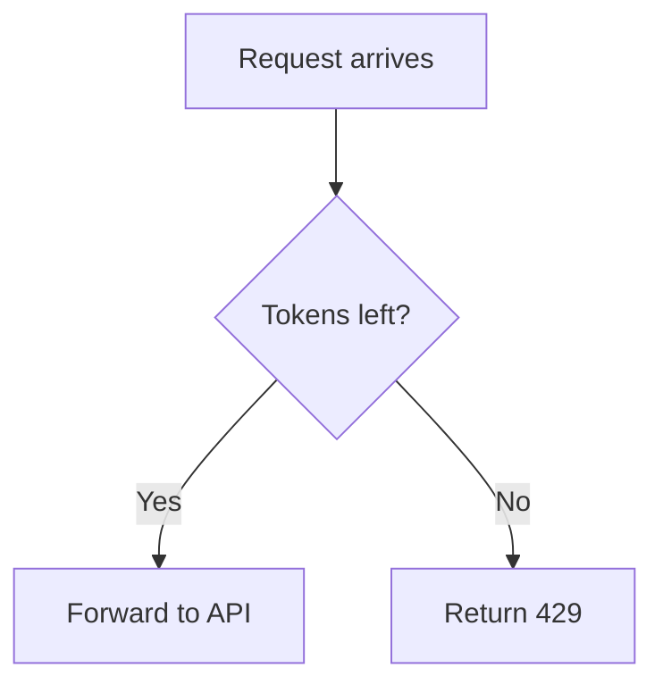

When an agent answers with a Mermaid diagram or a LaTeX formula, Pincer draws it in the transcript instead of showing the source. Everything is drawn on your device by Pincer itself. There's no web view, no downloaded script and no network request, and nothing is sent anywhere to be rendered.

Try it in the [built-in demo](../../getting-started/try-the-demo/): open **Claw → Rate limiter design** for a flowchart, a sequence diagram, two formulas and an HTML page to preview.

## Mermaid diagrams

A fenced code block tagged `mermaid` is drawn as a diagram:

````markdown

````

Pincer supports these diagram types:

| Type | Starts with | What's drawn |
| --- | --- | --- |
| Flowchart | `flowchart` or `graph`, with `TD`, `TB`, `LR`, `RL` or `BT` | Nodes in the usual shapes (rectangle, rounded, stadium, circle, diamond, hexagon, database, subroutine and more), solid, dotted and thick links, arrows, and link labels. Chains like `A --> B --> C` and `A & B --> C` work, and `subgraph` groups are drawn as boxes. |
| Sequence diagram | `sequenceDiagram` | Participants and actors, solid and dashed messages, notes, and `loop`, `alt`, `opt`, `par`, `critical` and `break` frames. |
| Pie chart | `pie` | Slices with a legend and an optional title. `showData` adds the values. |

Styling lines (`classDef`, `class`, `style`, `linkStyle`) and `click` handlers are ignored. A `title` in front matter is drawn above the diagram. Diagrams use colours that match light or dark mode.

Other diagram types (class, state, Gantt, ER and so on), and diagrams Pincer can't read, stay as a code block, so you can still read and copy the source.

## Math

Display math is drawn as a formula when it's on its own lines between `$$` and `$$`, or `\[` and `\]`, or in a code block tagged `math`, `latex` or `tex`:

```markdown
$$
T(t) = \min\left(b,\; T_0 + r\,(t - t_0)\right)
$$
```

Pincer understands the LaTeX that agents usually write: Greek letters and common symbols, superscripts and subscripts, fractions, roots, sums, products and integrals with limits, `\left` and `\right` brackets, accents like `\hat` and `\vec`, `\text`, `\mathbb` and `\mathbf`, and matrices, `cases` and `aligned` rows. An unknown command is shown by name in red, like other LaTeX renderers do. A formula with unbalanced braces stays as source.

Inline math is drawn in the line of text when it's between single dollar signs, like `$x^2$`, or between `\(` and `\)`. It's drawn a little more compactly than display math, so sums and fractions don't stretch the line. To keep prices and shell variables as text, Pincer only treats a dollar sign as math when the opening `$` is followed by a non-space and the closing `$` follows a non-space and isn't followed by a letter or digit. So "$5 and $10" and `$HOME/$USER` stay as written. Math inside `code` spans is never drawn, and `\$` is always a dollar sign. An inline formula with an unknown command is shown as written.

## HTML preview

A code block tagged `html` has a **Preview** button in its header. It opens the page in a sheet so you can see what the agent built without leaving Pincer.

The preview is locked down:

- Scripts don't run.
- Nothing is loaded from the network. Only inline styles and `data:` images show.
- Links don't open, and nothing the page does is saved.

To run the page for real, copy the code and open it in a browser.

## Working with a drawn block

- Tap or click a diagram or formula to open it full size, where you can zoom, save or share it.
- Choose **Diagram source** or **Math source** under it to show the source it was drawn from, with a **Copy** button.
- **Copy** on the message still copies the original Markdown, with the source.
- [Find in chat](../search/) searches the text around a diagram or formula, but not its source, including inline math.
- While a reply is still streaming, a diagram or formula shows as code until its block is complete, and then it's drawn once.
- VoiceOver reads a diagram as "Mermaid diagram" and a formula as "Math expression". Open the source to hear it.

## Limits

To keep the transcript fast, Pincer draws a diagram only once, keeps a small cache of recent ones, and leaves a very large diagram as code: more than 150 nodes or participants, more than 400 links or messages, or more than 20,000 characters. A formula longer than 4,000 characters also stays as code.
